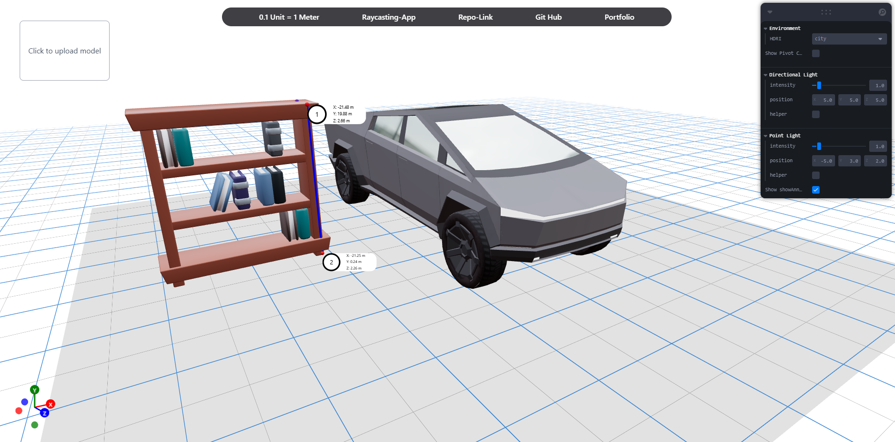

# 📍 Raycasting App — 3D Point Annotation Tool

An interactive 3D raycasting tool built with **React Three Fiber** and **three-mesh-bvh**. This app allows users to upload a 3D model, place 3D points by double-clicking on the surface, draw measurement lines, and display spatial annotations — ideal for spatial analysis, planning, or educational use.



---

## ✨ Features

- ✅ Upload and view `.glb` models
- 🎯 Raycast-based point placement
- 📏 Live 3D measurement lines between points
- 🧭 Pivot & Gizmo controls
- 💡 Toggleable directional & point lights
- 🌐 Switchable environment (HDRI)
- 📦 BVH-accelerated raycasting for fast interaction
- ⚡ Maintains 60+ FPS on mid-range machines
- 🧪 Leva controls for light, environment, and annotation toggling

---

## 🛠️ Installation

```bash
git clone https://github.com/abhishekmill/Dronee-Task-Raycasting.git)
cd raycasting-app
npm install
npm run dev
```
